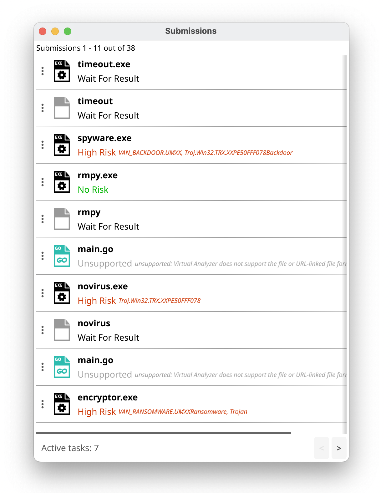
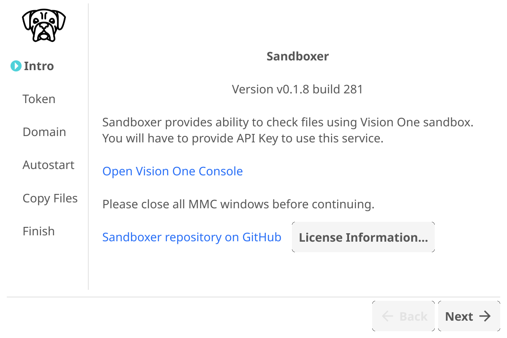
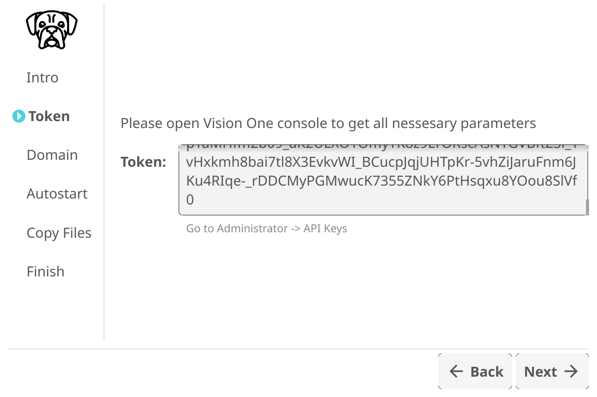
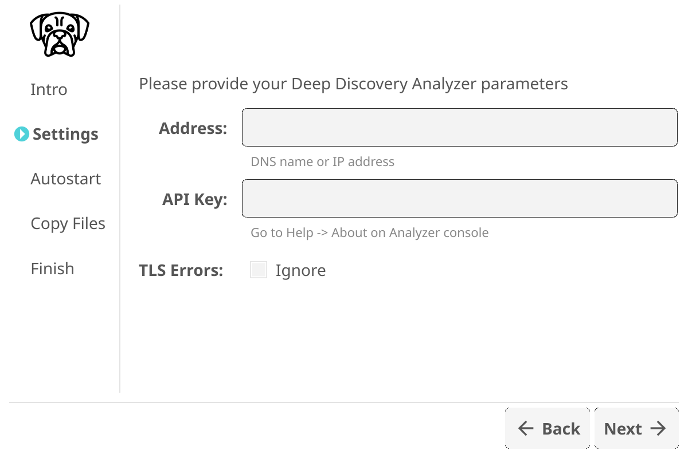
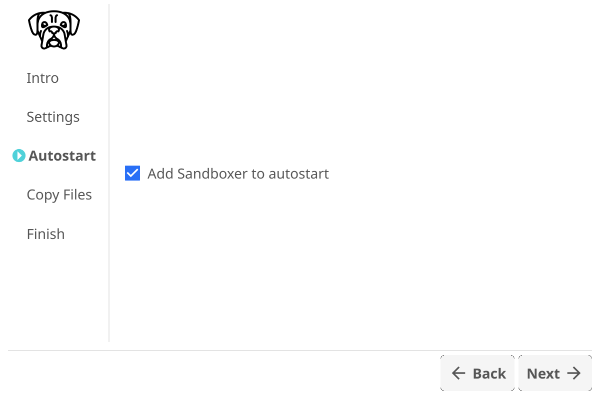
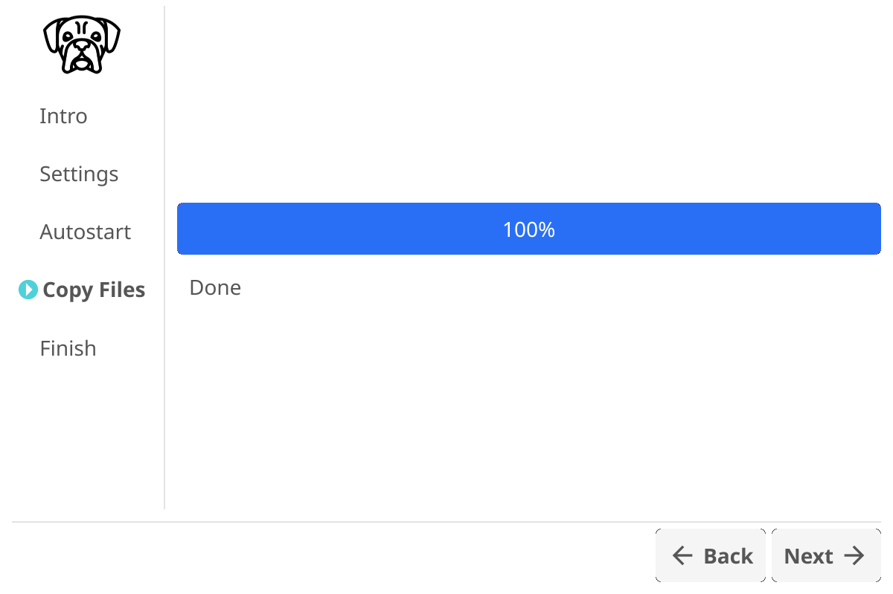
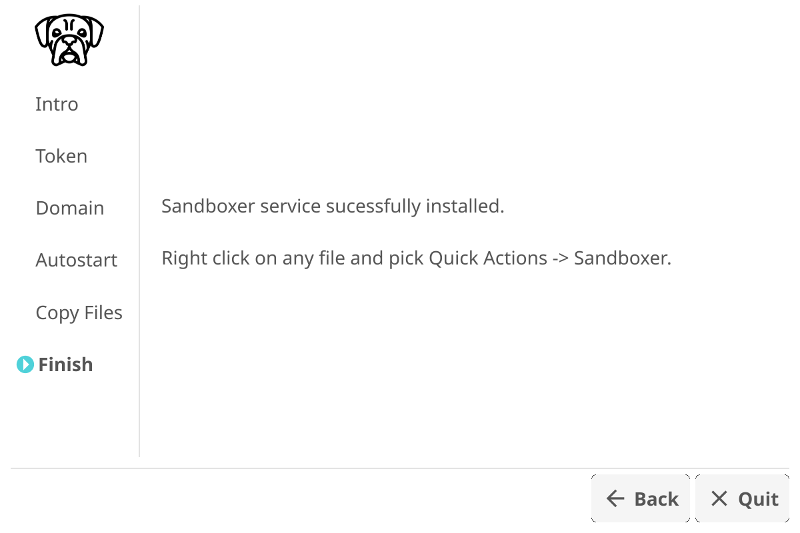
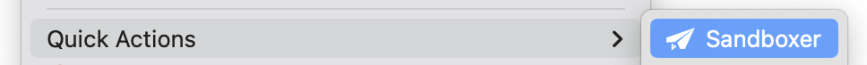
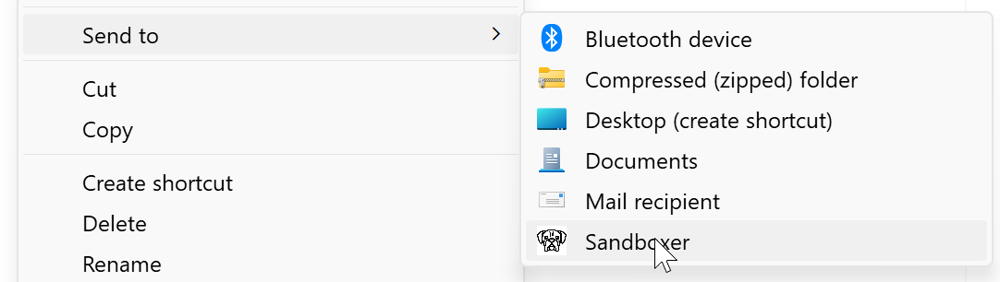
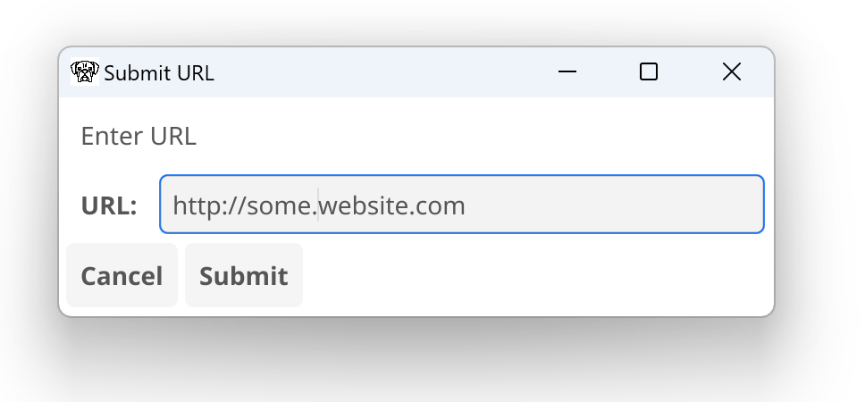

# Sandboxer

## Inspect objects using Trend Micro Vision One or Deep Discovery Analyzer sandbox

## Features

1. Inspected objects: Files and URLs
2. Supported sandboxes: Vision One and Deep Discovery Analyzer 
3. Supported platforms: Windows and macOS

Sandboxer submissions window:

## Installation
Installation and usage video:

Download [latest release](https://github.com/mpkondrashin/sandboxer/releases/latest) for your platform, unpack zip file, and run setup.exe (for Windows) or SandboxerInstaller (for macOS).

<kbd></kbd>

Choose your sanbox type: <a href="https://docs.trendmicro.com/en-us/documentation/article/trend-vision-one-sandbox-analysis">Vision One</a> or <a href="https://www.trendmicro.com/en_ca/business/products/network/advanced-threat-protection/analyzer.html">Deep Discovery Analyzer</a>. Then press "Next" button.

<kbd></kbd>

If you selected Vision One on the first step, then enter Token. Learn more about <a href="https://docs.trendmicro.com/en-us/documentation/article/trend-vision-one-api-keys">API Keys</a> and <a href="https://docs.trendmicro.com/en-US/documentation/article/trend-vision-one-configuring-user-rol">Roles</a>. 
If correct Domain value is not detected automatically, choose it from dropdown list.
 

<kbd></kbd>

If you selected Deep Discovery Analyzer on the first step, provide its IP/DNS address and API Key. If you are using self-signed certificate, check TLS Errors Ignore.

<kbd></kbd>

Remove checkbox is there is not need to run Sandboxer automatically. It will be launched automatically upon file submission.

<kbd></kbd>

Wait for file copy process to finish.

<kbd></kbd>

Press "Quit" button.

## Usage

### To Submit File On macOS

Right click on file and choose Quick Actions -> Sandboxer

### To Submit Files On Windows

Right click on file and choose Send To -> Sandboxer. Note that for latest Windows, you will have to chosse first "Show more options".

### To Submit URL
Run Sandboxer, if it is not yet running, and pick from its system tray icon menu "Submit URL" item.

### To Get Results
Pick from Sandboxer system tray icon menu "Submissions" item. Right click on the menu icon "⋮" and choose "Show Report" or "Investigation Package".

Icon is taken from <a href="https://www.flaticon.com/free-icons/dog" title="dog icons">Dog icons created by Freepik - Flaticon</a>